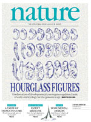
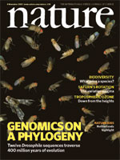
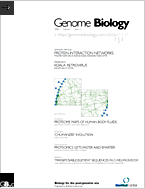
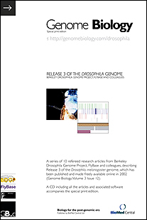

Contributions from Bergman Lab members are underlined in the publication list below. Lists of publications co-authored by Casey Bergman can be found in <a href="https://www.ncbi.nlm.nih.gov/myncbi/casey%20m.bergman.1/bibliography/public/" >PubMed</a>, <a href="https://orcid.org/0000-0002-5462-9854" >Orcid</a>, or <a href="https://scholar.google.com/citations?hl=en&amp;user=j9ciKqkAAAAJ&amp;view_op=list_works&amp;sortby=pubdate" >Google Scholar</a>.

## Manuscripts

Chen, J., D.J. Garfinkel &amp; C.M. Bergman (submitted) Horizontal transfer and recombination fuel Ty4 retrotransposon evolution in <em>Saccharomyces</em>. [<a href="https://www.biorxiv.org/content/10.1101/2023.12.20.572574v1">preprint</a>]

## 2024

Hannon-Hatfield, J.A., Chen, J., C.M. Bergman &amp;&nbsp; D.J. Garfinkel (2024) Evolution of a restriction factor by domestication of a yeast retrotransposon. <a href="https://academic.oup.com/mbe/article/41/3/msae050/7621844" ><em>Mol. Biol. Evol.</em> <strong>41</strong>:msae050</a>.

## 2023

Chen, J. (2023) <a href="https://www.proquest.com/docview/2917422789" >Bioinformatics and evolutionary genomics of transposable elements in yeast.</a> Ph.D. Thesis, University of Georgia, USA.

Chen, J., P.J. Basting, S. Han, D.J. Garfinkel &amp; C.M. Bergman (2023) Reproducible evaluation of transposable element detectors with  McClintock 2 guides accurate inference of Ty insertion patterns in yeast. <a href="https://mobilednajournal.biomedcentral.com/articles/10.1186/s13100-023-00296-4" ><em>Mobile DNA</em> <strong>14</strong>:8</a>.

## 2022

Han, S., G.B. Dias, P.J. Basting, R. Viswanatha, N. Perrimon &amp; C.M. Bergman (2022) Local assembly of long reads enables phylogenomics of transposable elements in a polyploid cell line. <a href="https://doi.org/10.1093/nar/gkac794" ><em>Nucleic Acids Research</em> <strong>50</strong>:gkac794</a>.

Han, S., G.B. Dias, P.J. Basting, M.G. Nelson, S. Patel, M. Marzo &amp; C.M. Bergman (2022) Ongoing transposition in cell culture reveals the phylogeny of diverse <em>Drosophila</em> S2 sub-lines. <a href="https://doi.org/10.1093/genetics/iyac077" ><em>Genetics </em><strong>221</strong>:iyac077</a>.

Mariyappa, D., D. Brandt-Rusch, S. Han, A. Luhur, D. Overton, C. Yang, C.M. Bergman &amp; A.C. Zelhof (2022) A novel transposable element-based authentication protocol for <em>Drosophila</em> cell lines. <a href="https://academic.oup.com/g3journal/article/12/2/jkab403/6440050" ><em>G3</em> <strong>12</strong>:jkab403</a>.

Chen, J., H. McQueary, D.W. Hall, P. Philippsen, D.J. Garfinkel &amp; C.M. Bergman (2022) Genome assembly of the Ty1-less <em>Saccharomyces paradoxus</em> strain DG1768. <a href="https://journals.asm.org/doi/10.1128/mra.00868-21" ><em>Microbiology Resource Announcements</em> <strong>11</strong>:e00868-21</a>.

Chen, J., D.J. Garfinkel &amp; C.M. Bergman (2022) Long read genome assembly of <em>Saccharomyces uvarum</em> strain CBS 7001. <a href="https://journals.asm.org/doi/full/10.1128/mra.00972-21" ><em>Microbiology Resource Announcements</em> <strong>11</strong>:e00972-21</a>.

## 2021

Han, S. (2021) <a href="https://www.proquest.com/docview/2627523092" >Novel computational strategies for the analysis of transposable elements in <em>Drosophila</em> cell culture genomes</a>. Ph.D. Thesis, University of Georgia, USA.

Dias, G.B., A.M. Aldossary, H.A.F. El-Shafie, F.M. Alhoshani, M.B. Al-Fageeh, <u>C.M. Bergman</u> &amp; M.M. Manee (2021) Complete mitochondrial genome of the longhorn date palm stem borer <em>Jebusaea hammerschmidtii</em>. <a href="https://www.tandfonline.com/doi/full/10.1080/23802359.2021.1989334" ><em>Mitochondrial DNA Part B: Resources</em> <strong>6</strong>:3214-3216.</a>

Han, S., P.J. Basting, G.B. Dias, A. Luhur, A.C. Zelhof &amp; C.M. Bergman (2021) Transposable element profiles reveal cell line identity and loss of heterozygosity in <em>Drosophila</em> cell culture. <a href="https://academic.oup.com/genetics/article/219/2/iyab113/6321957" ><em>Genetics </em><strong>219</strong>:iyab113</a>.

Dias, G.B, M.A. Altammami, H.A.F. El-Shafie, F.M. Alhoshani, M.B. Al-Fageeh, C.M. Bergman &amp; M.M. Manee. (2021) Haplotype-resolved diploid genome assembly enables gene discovery in the red palm weevil <em>Rhynchophorus ferrugineus</em>. <a href="https://www.nature.com/articles/s41598-021-89091-w" ><em>Scientific Reports</em> <strong>11</strong>:9987.</a>

## 2020

Chung, M., P.J. Basting, R.S. Patkus, A. Grote, A.N. Luck, E. Ghedin, B.E. Slatko, M. Michalski, J. Foster, C.M. Bergman &amp; J.C. Dunning Hotopp (2020) A meta-analysis of <em>Wolbachia</em> transcriptomics reveals a stage-specific <em>Wolbachia</em> transcriptional response shared across different hosts. <a href="https://academic.oup.com/g3journal/article/10/9/3243/6060156" ><em>G3</em> <strong>10</strong>:3243-3260</a>.

Czaja, W., D. Bensasson, H.W. Ahn, D.J. Garfinkel &amp; C.M. Bergman. (2020) Evolution of Ty1 copy number control in yeast by horizontal transfer and recombination. <a href="https://journals.plos.org/plosgenetics/article?id=10.1371/journal.pgen.1008632" ><em>PLOS GENETICS </em><strong>16</strong>:e1008632</a>.

Hemmer, L.W., G. Dias, B. Smith, K. Van Vaerenberghe, A. Howard, <u>C.M. Bergman</u> &amp; J.P. Blumenstiel. (2020) Hybrid dysgenesis in <em>Drosophila virilis</em> results in clusters of mitotic recombination and loss-of-heterozygosity but leaves meiotic recombination unaltered. <a href="https://mobilednajournal.biomedcentral.com/articles/10.1186/s13100-020-0205-0" ><em>Mobile DNA </em><strong>11</strong>:10</a>.

## 2019

Basting, P.J. &amp; <u>C.M. Bergman</u> (2019) Complete genome assemblies for three variants of the <em>Wolbachia</em> endosymbiont of <em>Drosophila melanogaster</em>. <a href="https://mra.asm.org/content/8/45/e00956-19" ><em>Microbiology Resource Announcements </em><strong>8</strong>:e00956-19</a>.

Hamlin, J.A.P., G. Dias, <u>C.M. Bergman</u>, &amp; D. Bensasson (2019) Phased diploid assemblies for three strains of <em>Candida albicans</em> isolated from oak trees. <a href="https://academic.oup.com/g3journal/article/9/11/3547/6026742" ><em>G3 </em><strong>9</strong>:3547-3554</a>.

Duc, C., M. Yoth, S. Jensen, N. Mouniee, C.M. Bergman, C. Vaury, E. Brasset. (2019) Trapping a somatic endogenous retrovirus  into a germline piRNA cluster immunizes the germline against further invasion. <a href="https://genomebiology.biomedcentral.com/articles/10.1186/s13059-019-1736-x" ><em>Genome Biology</em> <strong>20</strong>:127</a>.

## 2018

Grobler, Y., C.Y. Yun, D.J. Kahler, C.M. Bergman, H. Lee, B. Oliver &amp; R. Lehmann (2018) Whole genome screen reveals novel relationship between <em>Wolbachia</em> and <em>Drosophila </em>host translation. <a href="https://journals.plos.org/plospathogens/article?id=10.1371/journal.ppat.1007445" ><em>PLOS Pathogens</em> <strong>14</strong>:e1007445</a>.

Bergman, C.M. (2018) Horizontal transfer and proliferation of <em>Tsu4</em> in <em>Saccharomyces paradoxus</em>. <a href="https://mobilednajournal.biomedcentral.com/articles/10.1186/s13100-018-0122-7" ><em>Mobile</em><em> DNA</em> <strong>9</strong>:18</a>.

Manee, M.M., J. Jackson, and C.M. Bergman (2018) Conserved noncoding elements influence the transposable element landscape in <em>Drosophila</em>. <a href="https://academic.oup.com/gbe/article/10/6/1533/5020726" ><em>Genome Biology and Evolution</em><strong> 10</strong>:1533-1545</a>.

## 2017

Bergman, C.M., S. Han, M.G. Nelson, V. Bondarenko, I.A. Kozeretska (2017) Genomic analysis of <em>P</em> elements in natural populations of <em>Drosophila melanogaster</em>.&nbsp;<a href="https://peerj.com/articles/3824/" ><em>PeerJ</em> <strong>5</strong>:e3824</a>.

Nelson, M.G., R.S. Linheiro &amp; C.M. Bergman (2017) McClintock: An integrated pipeline for detecting transposable element insertions in whole genome shotgun sequencing data. <a href="http://www.g3journal.org/content/7/8/2763" ><em>G3</em> <strong>7</strong>:2763-2778</a>.

## 2016

Barsh G.S., C.M. Bergman, C.D. Brown, N.D. Singh &amp; G.P. Copenhaver. Bringing <em>PLOS Genetics</em> editors to preprint servers. <a href="http://journals.plos.org/plosgenetics/article?id=10.1371/journal.pgen.1006448" ><em>PLOS Genetics</em> <strong>12</strong>:e1006448</a>

Gutzwiller, F. (2016) <a href="https://research.manchester.ac.uk/en/studentTheses/evolution-and-gene-expression-of-wolbachia-in-d-melanogaster" >Evolution and gene expression of <em>Wolbachia</em> in <em>D. melanogaster</em></a>. Ph.D. Thesis, University of Manchester, UK.

Manee, M. (2016) <a href="https://research.manchester.ac.uk/en/studentTheses/comparative-genomics-of-noncoding-dna" >Comparative genomics of noncoding DNA</a>. Ph.D. Thesis, University of Manchester, UK.

Miller D.E., K.R. Cook, N. Yeganeh Kazemi, C.B. Smith, A.J. Cockrell, R.S. Hawley &amp; C.M. Bergman. (2016) Rare recombination events generate sequence diversity among balancer chromosomes in <em>Drosophila melanogaster</em>. <a href="http://www.pnas.org/content/113/10/E1352.long" ><em>Proceedings of the National Acadamey of Sciences </em><strong>113</strong>:E1352-61</a>.

Nelson, M.G. (2016) <a href="https://research.manchester.ac.uk/en/studentTheses/bioinformatic-approaches-to-detect-transposable-element-insertion" >Bioinformatic approaches to detect transposable element insertions in high throughput sequence data from <em>Saccharomyces</em> and <em>Drosophila</em></a>. Ph.D. Thesis, University of Manchester, UK.

## 2015

Rahman, R, G. Chirn, A. Kanodia, Y.A. Sytnikova, B. Brembs, C.M. Bergman &amp; N.C. Lau (2015) Unique transposon landscapes are pervasive across <em>Drosophila melanogaster</em> genomes. <em><a href="http://nar.oxfordjournals.org/content/43/22/10655.long" >Nucleic Acids Research </a></em><a href="http://nar.oxfordjournals.org/content/43/22/10655.long" ><strong>43</strong></a><a href="http://nar.oxfordjournals.org/content/43/22/10655.long" >: 10655-10672</a>.

Gutzwiller F., C.R. Carmo, D.E. Miller, D.W. Rice, I.L. Newton, L. Teixeira &amp; C.M. Bergman (2015) Dynamics of <em>Wolbachia pipientis</em> gene expression across the <em>Drosophila melanogaster</em> life cycle. <a href="http://www.g3journal.org/content/5/12/2843.long" ><em>G3 </em><strong>5</strong>:2843-56</a><em>. 
</em>

Dudzic, J.P., S. Kondo, R. Ueda, C.M. Bergman &amp; B. Lemaitre (2015) Drosophila innate immunity: regional and functional specialization of prophenoloxidases. <a href="http://www.biomedcentral.com/1741-7007/13/81" ><em>BMC Biology</em> <b>13</b>:81</a>.

Bergman, C.M. &amp; P.R. Haddrill (2015) Strain-specific and pooled genome sequences for populations of <em>Drosophila melanogaster</em> from three continents. <a href="http://f1000research.com/articles/4-31/v1" ><em>F1000Research</em> <b>4</b>:31</a>.

Mateo J.L., D.L. van den Berg, M. Haeussler,
D. Drechsel, Z.B. Gaber, D.S. Castro, P. Robson, G.E. Crawford, P. Flicek, L. Ettwiller, J. Wittbrodt, F. Guillemot, B. Martynoga. Characterization of the neural stem cell gene regulatory network identifies OLIG2 as a multi-functional regulator of self-renewal. <a href="http://genome.cshlp.org/content/25/1/41" ><em>Genome Research</em> <strong>25</strong>:41-56</a>.

## 2014

Kim, K., P. Peluso, P. Baybayan, P.J. Yeadon, C. Yu, W. Fisher, C.-S. Chin, N.A. Rapicavoli, D.R. Rank, J. Li, D. Catcheside, S.E. Celniker, A.M. Phillippy, C.M. Bergman &amp; J.M. Landolin (2014) Long-read, whole genome shotgun sequence data for five model organisms. <a href="http://www.nature.com/articles/sdata201445" ><em>Scientific Data</em> <b>1</b>: 140045</a>.

Blumenstiel, J.P., X. Chen, M. He&nbsp;&amp; C.M. Bergman (2014) An age-of-allele test of neutrality for transposable element insertions. <a href="http://www.genetics.org/content/196/2/523" ><em>Genetics</em> </a><a href="http://www.genetics.org/content/196/2/523" ><strong>196</strong>: 523-538</a>.

## 2013

Prokop, A. &amp; C.M. Bergman (2013) Photogenic Flies – A review of Chyb and Gompel’s Atlas of <em>Drosophila</em> Morphology: Wild-type and Classical Mutants. <a href="http://www.frontiersin.org/evolutionary_and_population_genetics/10.3389/fgene.2013.00147/full" ><em>Frontiers in Genetics</em> <b>4</b>:147</a>.

Oliveres-Chauvet, P. (2013) <a href="https://research.manchester.ac.uk/en/studentTheses/multi-scale-analysis-of-chromosome-and-nuclear-architecture" >Multi-scale analysis of chromosome and nuclear architecture</a>. Ph.D. Thesis, University of Manchester, UK.

## 2012

Kayserili, M.A., D.T. Gerrard, P. Tomancak &amp; A.T. Kalinka (2012) An Excess of gene expression divergence on the X chromosome in <em>Drosophila</em> embryos: implications for the faster-X hypothesis <a href="http://www.plosgenetics.org/article/info%3Adoi%2F10.1371%2Fjournal.pgen.1003200" ><em>PLOS Genetics</em> <strong>8</strong>:e1003200</a>.

Richardson, M.F., L.A. Weinert, J.J. Welch, R.S. Linheiro, M.M. Magwire, F.M. Jiggins &amp; C.M. Bergman (2012) Population genomics of the <em>Wolbachia</em> endosymbiont in <em>Drosophila melanogaster</em>.&nbsp;<a href="http://www.plosgenetics.org/article/info%3Adoi%2F10.1371%2Fjournal.pgen.1003129" ><em>PLOS Genetics</em> <strong>8</strong>:e1003129</a>. [See also: <a href="http://bergmanlab.uga.edu/?p=1398">web companion</a>].

Carr, M., D. Bensasson&nbsp;&amp; C.M. Bergman (2012) Evolutionary genomics of transposable elements in<em> Saccharomyces cerevisiae</em>. <a href="http://www.plosone.org/article/info%3Adoi%2F10.1371%2Fjournal.pone.0050978" ><em>PLOS ONE</em> <strong>7</strong>:e50978</a>.

Gerner, M., F. Sarafraz, C.M. Bergman &amp; G. Nenadic. (2012) BioContext: an integrated text mining system for large-scale extraction and contextualisation of biomolecular events. <a href="http://bioinformatics.oxfordjournals.org/content/28/16/2154.full" ><em>Bioinformatics</em> <strong>28</strong>:2154-2161<cite></cite></a>. [See also: <a href="http://www.biocontext.org/" >web companion</a> &amp; Martin Gerner’s <a href="http://www.youtube.com/watch?v=Sw5436vHYE8" >presentation</a> describing this project at the 2011 DBCLS BioHackathon on YouTube’s togoTV channel]

Jamieson, D., M. Gerner, F. Sarafraz, G. Nenadic &amp; D. Roberton. (2012) Towards  semi-automated curation: using text mining to recreate the HIV-1, human protein interaction database. <a href="http://www.ncbi.nlm.nih.gov/pubmed/22529179" ><em>Database</em> <strong>2012</strong>:bas023</a>.

Gerner, M. (2012) <a href="https://research.manchester.ac.uk/en/studentTheses/integrating-text-mining-approaches-to-identify-entities-and-extra" >Integrating text-mining approaches to identify entities and extract events from the biomedical literature</a>. Ph.D. Thesis, University of Manchester, UK.

Bergman, C.M. (2012) A proposal for the reference-based annotation of <em>de novo</em> transposable element insertions. <em><a href="http://www.landesbioscience.com/journals/mge/article/19479/" >Mobile Genetic Elements </a></em><a href="http://www.landesbioscience.com/journals/mge/article/19479/" ><strong>2</strong>:1-4</a>.

Linheiro, R.S. &amp; C.M. Bergman. Whole genome resequencing reveals natural target site preferences of transposable elements in <em>Drosophila melanogaster</em>. <a href="http://www.plosone.org/article/info%3Adoi%2F10.1371/journal.pone.0030008" ><em>PLoS ONE</em> <strong> 7</strong>:e30008</a>.

Mackay, T.F.C., S. Richards, E.A. Stone, A. Barbadilla, J.F. Ayroles, D. Zhu, S. Casillas, Y. Han, M.M. Magwire, J.M. Cridland, M.F. Richardson, R.R.H. Anholt, M. Barron, C. Bess, K.P. Blankenburg, M.A. Carbone, D. Castellano, L. Chaboub, L. Duncan, Z. Harris, M. Javaid, J.C. Jayaseelan, S.N. Jhangiani, K.W. Jordan, F. Lara, F. Lawrence, S.L. Lee, P. Librado, R.S. Linheiro, R.F. Lyman, A.J. Mackey, M. Munidasa, D.M. Muzny, L. Nazareth, I. Newsham, L. Perales, L.-L. Pu, C. Qu, M. Ramia, J.G. Reid, S.M. Rollmann, J. Rozas, N. Saada, L. Turlapati, K.C. Worley, Y.-Q. Wu, A. Yamamoto, Y. Zhu, C.M. Bergman, K.R. Thornton, D. Mittelman and R.A. Gibbs (2012). The <em>Drosophila</em> <em>melanogaster</em> Genetic Reference Panel.” <a href="http://www.nature.com/nature/journal/v482/n7384/full/nature10811.html" ><em>Nature</em> <strong>482</strong>:173-178</a>. [Research Highlight in <a href="http://www.nature.com/nrg/journal/v13/n3/full/nrg3193.html" ><em>Nature Genetics</em></a>]

## 2011

Z. Lu, H.Y. Kao, C.H. Wei, M. Huang, J. Liu, C.J. Kuo, C.N. Hsu, R. Tsai, H.J. Dai, N. Okazaki, H.C. Cho, M. Gerner, I. Solt, S. Agarwal, F. Liu, D. Vishnyakova, P. Ruch, M. Romacker, F. Rinaldi, S. Bhattacharya, P. Srinivasan, H. Liu, M. Torii, S. Matos, D. Campos, K. Verspoor, K. Livingston &amp; W.J. Wilbur (2011) The gene normalization task in BioCreative III.&nbsp;<a href="http://www.biomedcentral.com/1471-2105/12/S8/S2" ><em>BMC Bioinformatics</em> <strong>12</strong>(Suppl 8 )<strong>:</strong>S2</a>.

Baran, J., M. Hauessler, M. Gerner, G. Nenadic &amp; C.M. Bergman. (2011) pubmed2ensembl: a resource for mining the biological literature on genes. <a href="http://www.plosone.org/article/info%3Adoi%2F10.1371%2Fjournal.pone.0024716" ><em>PLoS ONE</em> <strong>6</strong>:e24716</a>. [See also: <a href="http://www.pubmed2ensembl.org/" >web companion</a>]

Hakenberg, J., M. Gerner, M. Haeussler, C. Plake, M. Schroeder, G. Gonzalez, G. Nenadic &amp; C.M. Bergman (2011) The GNAT library for online and offline gene mention normalization. <a href="http://bioinformatics.oxfordjournals.org/content/27/19/2769.full" ><em>Bioinformatics </em> <strong>27</strong>:2769-2771</a>. [See also: <a href="http://gnat.sourceforge.net/" >web companion</a>]

Sherwood A.M., C. Desmarais, R.J. Livingston, J. Andriesen, M. Haussler, C.S. Carlson &amp; H. Robins (2011) Deep sequencing of the human TCRγ and TCRβ repertoires suggests that TCRβ rearranges after αβ and γδ T cell commitment. <a href="http://stm.sciencemag.org/content/3/90/90ra61.long" ><em>Science Translational Medicine</em> <strong>3</strong>:90ra61</a>.

Linheiro, R.S. (2011) <a href="https://research.manchester.ac.uk/en/studentTheses/computational-analysis-of-transposable-element-target-site-prefer" >Computational analysis of transposable element target site preferences in <em>Drosophila melanogaster</em></a>. Ph.D. Thesis, University of Manchester, UK.

Haeussler, M., M. Gerner &amp; C.M. Bergman (2011) Annotating genes and genomes with DNA sequences extracted from biomedical articles. <a href="http://bioinformatics.oxfordjournals.org/content/27/7/980" ><em>Bioinformatics</em> <strong>27</strong>:980-6</a>. [See also: <a href="http://www.text2genome.org/" >web companion</a>] [<em>Nature</em> <a href="http://www.nature.com/news/trouble-at-the-text-mine-1.10184" >News</a>] [SPARC <a href="http://www.arl.org/sparc/media/pushing-frontier-access-for-text-mining-Piwowar-interview.shtml" >Article</a>] [Guardian <a href="http://www.guardian.co.uk/science/2012/may/23/text-mining-research-tool-forbidden" >Article</a>] [NRC Handelsblad <a href="http://archief.nrc.nl/index.php/2013/April/6/Wetenschap/NH_NL04_007/Hier+mag+u+wel+even+kijken%2C+maar+niet+graven/check=Y" >Article</a> (in Dutch, requires subscription)].

Mendez-Lago, M., C.M. Bergman, B. de Pablos, A. Tracey, S.L. Whitehead, and A. Villasante. (2011) A large palindrome with interchromosomal duplications in the pericentromeric region of the <em>D. melanogaster</em> Y chromosome. <a href="http://mbe.oxfordjournals.org/content/28/7/1967" ><em>Mol. Biol. Evol.</em> <strong>28</strong>:1967-71</a>.

Gallo, S.M, D.T. Gerrard, M. Simich, B. Dessoye, C.M. Bergman &amp; M.S. Halfon (2011) REDfly v3.0: Towards a comprehensive database of transcriptional regulatory elements in <em>Drosophila</em>. <a href="http://nar.oxfordjournals.org/content/39/suppl_1/D118" ><em>Nucleic Acids Research</em> <strong>39</strong>: D118-D123.</a> [See also: <a href="http://redfly.ccr.buffalo.edu/" >web companion</a>]

## 2010

Kalinka, A.T., K. Varga, D.T. Gerrard, S. Preibisch, D. Corcoran, J. Jarrells, U. Ohler, C.M. Bergman &amp; P. Tomancak. (2010) Gene expression divergence recapitulates the developmental hourglass model. <a href="http://www.nature.com/nature/journal/v468/n7325/full/nature09634.html" ><em>Nature</em> <strong>468</strong>:811-814</a>. [See also Pavel Tomancak’s <a href="http://www.mpi-cbg.de/en/research/research-groups/pavel-tomancak/in-the-news.html" >round-up of media coverage</a> on this article] [News and Views in<a href="http://www.nature.com/nature/journal/v468/n7325/full/468768a.html" > <em>Nature</em></a>] [Listen also to Henry Gee discuss this work on the <em>Nature</em> <a href="http://media.nature.com/download/nature/nature/podcast/v468/n7325/nature-2010-12-09.mp3" >podcast</a>.]

Solt, I., M. Gerner, P. Thomas, G. Nenadic, C.M. Bergman, U. Leser &amp; J. Hakenberg (2010) Gene mention normalization in full texts using GNAT and LINNAEUS.<em> <a href="http://www.biocreative.org/media/store/files/2011/BioCreative_III_Proceedings_.pdf" >Proceedings of the BioCreative III Workshop pp 134-139</a></em>.

Barton M., D. Delneri, S.G. Oliver, M. Rattray &amp; C.M. Bergman. (2010) Evolutionary systems biology of amino acid biosynthetic cost in yeast. <a href="http://www.plosone.org/article/info%3Adoi%2F10.1371%2Fjournal.pone.0011935" ><em>PLoS ONE</em> <strong>5</strong>:e11935</a>.

Gerner M., G. Nenadic &amp; C.M. Bergman. (2010) An exploration of mining gene expression mentions and their anatomical locations from biomedical text. <a href="http://dl.acm.org/citation.cfm?id=1869970" ><em>Proceedings of the 2010 Workshop on Biomedical Natural Language Processing</em> pp.72-80</a>. [See also: <a href="http://getm-project.sourceforge.net/" >web companion</a>]

Rogers, H. C.M. Bergman &amp; S. Griffiths-Jones. (2010) Evolution of tRNA genes in <em>Drosophila</em>. <a href="http://gbe.oxfordjournals.org/cgi/content/short/2/0/467" ><em>Genome Biology and Evolution</em> <strong>2</strong>:467-477</a>.

Gerner M., G. Nenadic &amp; C.M. Bergman. (2010) LINNAEUS: a species name identification system for biomedical literature. <a href="http://www.biomedcentral.com/1471-2105/11/85/" ><em>BMC Bioinformatics</em> <strong>11</strong>:85</a>. [See also: <a href="http://linnaeus.sourceforge.net/" >web companion</a>] [<a href="http://www.biomedcentral.com/info/about/mostviewed/" >Highly Accessed</a> Article]

## 2009

Sackton T.B., R.J. Kulathinal, C.M. Bergman, A.R. Quinlan, E.B. Dopman, M. Carneiro, G.T. Marth, D.L. Hartl &amp; A.G. Clark (2009) Population genomic inferences from sparse high-throughput sequencing of two populations of <em>Drosophila melanogaster.</em> <a href="http://gbe.oxfordjournals.org/content/1/449.abstract" ><em>Genome Biology and Evolution</em> <strong>1</strong>:439-455</a>. [See also: Andy Clark’s NISC 10th Anniversary Symposium <a href="http://www.youtube.com/watch?v=V3j_Ec0RjeA" >presentation</a> on YouTube’s GenomeTV channel].

Barton, M.D. (2009) 
<a href="../assets/images/BartonThesis2009.pdf" class="image fit">Evolutionary systems biology of amino acid cost and gene importance in <em>Saccharomyces cerevisiae</em></a>. Ph.D. Thesis, University of Manchester, UK.

Yang H., J. Keane, C.M. Bergman, G. Nenadic. (2009) Assigning roles to protein mentions: the case of transcription factors. <a href="http://www.sciencedirect.com/science?_ob=ArticleURL&amp;_udi=B6WHD-4W2121B-1&amp;_user=121749&amp;_coverDate=10%2F31%2F2009&amp;_rdoc=16&amp;_fmt=high&amp;_orig=browse&amp;_srch=doc-info(%23toc%236848%232009%23999579994%231528180%23FLA%23display%23Volume)&amp;_cdi=6848&amp;_sort=d&amp;_docanchor=&amp;_ct=23&amp;_acct=C000024058&amp;_version=1&amp;_urlVersion=0&amp;_userid=121749&amp;md5=b113aee9595e5e7464160811fab9c91c" > <em>Journal of Biomedical Informatics</em> <strong>42</strong>:887-894</a>.

Liti, G.,D.M. Carter, A.M. Moses, J. Warringer, L. Parts, S.A. James, R.P. Davey, I.N. Roberts, A. Burt, V. Koufopanou, I.J. Tsai, C.M. Bergman, D. Bensasson, M.J.T. O’Kelly, A. van Oudenaarden, D.B.H. Barton, E. Bailes, A.N. Nguyen, M. Jones, M.A. Quail, I. Goodhead, S. Sims, F. Smith, A. Blomberg, R. Durbin &amp; E.J. Louis (2009) Population genomics of domestic and wild yeasts. <a href="http://www.nature.com/nature/journal/v458/n7236/full/nature07743.html" ><em>Nature</em> <strong>458</strong>:337-341</a>. [See also: <a href="http://www.sanger.ac.uk/research/projects/genomeinformatics/sgrp.html" >web companion</a>] [Editor’s Note in <a href="http://www.nature.com/nature/journal/v458/n7236/edsumm/e090319-10.html" ><em>Nature</em></a>] [Commentary in <a href="http://planetearth.nerc.ac.uk/features/story.aspx?id=579" >Planet Earth</a>]

## 2008

Linheiro, R.S. &amp; C.M. Bergman. (2008) Testing the palindromic target site model for DNA transposon insertion using the <em>Drosophila melanogaster</em> P-element. <a href="http://nar.oxfordjournals.org/cgi/content/full/36/19/6199" ><em>Nucleic Acids Research </em><strong>36</strong>:6199-6208</a>.

Altman, R. C.M. Bergman, J. Blake, C. Blaschke, A. Cohen, F. Gannon, L. Grivell, U. Hahn, W. Hersh, L. Hirschman, L.J. Jensen, M. Krallinger, B. Mons, S.I. O’Donoghue, M. Peitsch, D. Rebholz-Schumann, H. Shatkay &amp; A. Valencia. (2008) Text Mining for Biology: The Way Forward. <a href="http://genomebiology.com/2008/9/S2/S7" ><em>Genome Biology</em> <strong>9</strong>:S7</a>.

Aerts, S., M. Haeussler, O.L. Griffith, S. van Vooren, S.J.M. Jones, S. Montgomery, C.M. Bergman &amp; The Open Regulatory Annotation Consortium. (2008) Text-mining assisted regulatory annotation. <a href="http://genomebiology.com/2008/9/2/R31" ><em>Genome Biology</em> <strong>9</strong>:R31</a>. [<a href="http://www.biomedcentral.com/info/about/mostviewed/" >Highly Accessed</a> Article]

Halfon, M., S. Gallo &amp; C.M. Bergman. (2008) REDfly 2.0: an integrated database of <em>cis</em>-regulatory modules and transcription factor binding sites in <em>Drosophila</em>. <a href="http://nar.oxfordjournals.org/cgi/content/full/36/suppl_1/D594" ><em>Nucleic Acids Research</em> <strong>36</strong>: D594-D598</a>. [See also: <a href="http://redfly.ccr.buffalo.edu/" >web companion</a>]

Griffith O.L., S.B. Montgomery, B. Bernier, B. Chu, S. Aerts, M.C. Sleumer, M. Bilenky, M. Haeussler, M. Griffith, S.M. Gallo, B. Giardine, S. Mahony, B. Hooghe, P. Van Loo, E. Blanco, A. Ticoll, S. Lithwick, E. Portales-Casamar, I.J. Donaldson, G. Robertson, C. Wadelius, P. De Bleser, D. Vlieghe, M.S. Halfon, W. Wasserman, R. Hardison, C.M. Bergman, S.J.M. Jones &amp; The Open Regulatory Annotation Consortium. (2008) ORegAnno: an open-access community-driven resource for regulatory annotation. <a href="http://nar.oxfordjournals.org/cgi/content/full/36/suppl_1/D107" ><em>Nucleic Acids Research </em> <strong>36</strong>: D107-D113</a>. [See also: <a href="http://www.oreganno.org/" >web companion</a>]

## 2007

Bergman, C.M. &amp; H. Quesneville. (2007) Discovering and detecting transposable elements in genome sequences. <a href="http://bib.oxfordjournals.org/cgi/content/full/8/6/382" ><em>Briefings in Bioinformatics</em> <strong>8</strong>:382-392.</a> [See also: <a href="http://bergmanlab.uga.edu/?page_id=295">web companion</a>]

<em>Drosophila</em> 12 Genomes Consortium. (2007) Evolution of genes and genomes on the <em>Drosophila</em> phylogeny. <a href="http://www.nature.com/nature/journal/v450/n7167/abs/nature06341.html" ><em>Nature</em> <strong>450</strong>:203-218</a>. [News and Views in <a href="http://www.nature.com/nature/journal/v450/n7167/full/450184a.html" ><em>Nature</em></a>] [Commentary in <a href="http://blogs.openaccesscentral.com/blogs/bmcblog/entry/drosopholid_genome_studies_published" ><em>BMC</em></a>] [Commentary in <a href="http://www.cell.com/abstract/S0092-8674%2807%2901599-1" ><em>Cell</em></a>] [Commentary in <a href="http://www.nature.com/hdy/journal/v100/n4/abs/6801084a.html" ><em>Heredity</em></a>] [Commentary in <a href="http://www.sciencemag.org/cgi/content/short/318/5852/903" ><em>Science</em></a>] [See also: Andy Clark’s NISC 10th Anniversary Symposium <a href="http://www.youtube.com/watch?v=V3j_Ec0RjeA" >presentation</a> on YouTube’s GenomeTV channel] [Listen also: to <a href="https://bergmanlab.uga.edu/publications/12genomesRadio4.mp3">segment</a> on Radio 4’s Today Programme or Nature’s <a href="https://bergmanlab.uga.edu/publications/12genomesNaturePodcast.mp3">podcast</a>.]

Casillas, S., R. Egea, N. Petit, C.M. Bergman &amp; A. Barbadilla. (2007) <em>Drosophila</em> Polymorphism Database (DPDB): a portal for nucleotide polymorphism in <em>Drosophila</em>. <a href="http://www.landesbioscience.com/journals/fly/article/5043" ><em>Fly</em> <strong>1</strong>:4, e1-e7</a>. [See also: <a href="http://dpdb.uab.es/dpdb/dpdb.asp" >web companion</a>]

Casillas, S., A. Barbadilla &amp; C.M. Bergman. (2007) Purifying selection maintains highly conserved noncoding sequences in <em>Drosophila</em>. <a href="http://mbe.oxfordjournals.org/cgi/content/full/24/10/2222" ><em>Molecular Biology and Evolution </em><strong>24</strong>:2222-2234</a>.

Bergman, C.M. &amp; D. Bensasson. (2007) Recent LTR retrotransposon insertion contrasts with waves of non-LTR insertion since speciation in <em>Drosophila melanogaster</em>. <a href="http://www.pnas.org/cgi/content/full/104/27/11340" ><em>Proceedings of the National Acadademy of Sciences</em> <strong>104</strong>:11340-11345</a>.

Ranz, J.M., D. Maurin, Y.S. Chan, M. von Grotthuss, L.W. Hillier, J. Roote, M. Ashburner &amp; C.M. Bergman. (2007) Principles of genome evolution in the <em>Drosophila melanogaster</em> species group. <a href="http://biology.plosjournals.org/perlserv/?request=get-document&amp;doi=10.1371/journal.pbio.0050152" ><em>PLoS Biology </em><strong>5</strong>:e152</a>. [See also: commentary in <a href="http://www.nature.com/hdy/journal/v99/n5/abs/6801046a.html" ><em>Heredity</em></a>]

Down, T.A., C.M. Bergman, J. Su &amp; T.J.P. Hubbard. (2007) Large scale discovery of promoter motifs in<em> Drosophila melanogaster</em>. <a href="http://www.ploscompbiol.org/article/info:doi/10.1371/journal.pcbi.0030007" ><em>PLoS Computational Biology </em><strong>3</strong>:e7</a> [See also: <a href="http://servlet.sanger.ac.uk/tiffin/index.jsp" >web companion</a>]

## 2006

Bergman, C.M., H. Quesneville, D. Anxolabéhère &amp; M. Ashburner. (2006) Recurrent insertion and duplication generate networks of transposable element sequences in the <em>Drosophila melanogaster </em>genome. <a href="http://genomebiology.com/2006/7/11/R112" ><em>Genome Biology</em> <strong>7</strong>:R112</a>.

Pierstorff, N., C.M. Bergman &amp; T. Wiehe. (2006) Identifying <em>cis</em>-regulatory modules by combining comparative and compositional analysis of DNA. <a href="http://bioinformatics.oxfordjournals.org/cgi/content/full/22/23/2858" ><em>Bioinformatics </em><strong>22</strong>:2858-2864</a>.

Montgomery, S.B., O.L. Griffith, M.C. Sleumer, C.M. Bergman, M. Bilenky, E.D. Pleasance, Y. Prychyna, X. Zhang &amp; S.J.M. Jones. (2006) ORegAnno: An open access database and curation system for literature-derived promoters, transcription factor binding sites and regulatory variation. <a href="http://bioinformatics.oxfordjournals.org/cgi/content/full/22/5/637" ><em>Bioinformatics </em> <strong>22</strong>:637-640</a>.

## 2005

Ashburner, M. &amp; C.M. Bergman. (2005) <em>Drosophila melanogaster</em>: A case study of a genomic sequence and its consequences. <a href="http://www.genome.org/cgi/content/full/15/12/1661" ><em>Genome Research </em><strong>15</strong>:1661-1667.</a>

Lipatov, M., K.D. Lenkov, D.A. Petrov &amp; C.M. Bergman. (2005) Paucity of chimeric gene-transposable element transcripts in the <em>Drosophila melanagaster</em> genome. <a href="http://www.biomedcentral.com/1741-7007/3/24" ><em>BMC Biology </em><strong>3</strong>:24.</a> [BMC Research Highlight] [Highlighted in July 2006 <a href="http://bergmanlab.uga.edu/wp-content/uploads/2010/02/GeneticsSocietyNews55July06.pdf">Genetics Society News</a>].

Quesneville, H., C.M. Bergman, O. Andrieu, D. Autard, D. Nouaud, M. Ashburner &amp; D. Anxolabéhère. (2005) Combined evidence annotation of transposable elements in genome sequences. <a href="http://www.ploscompbiol.org/article/info:doi/10.1371/journal.pcbi.0010022" ><em>PLoS Computational Biology </em><strong>1</strong>:e22.</a>

Russell, S. &amp; C.M. Bergman. (2005) The <em>Drosophila</em> genome(s). <a href="http://www.mrw.interscience.wiley.com/emrw/9780470011539/ggpb/article/g204311/current/abstract" ><em>Encyclopedia of Genetics, Genomics, Proteomics and Bioinformatics</em></a>.

Bergman, C.M., J.W. Carlson and S.E. Celniker. (2005) <em>Drosophila</em> DNase I footprint database: A systematic genome annotation of transcription factor binding sites in the fruitfly, <em>D. melanogaster</em>. <a href="http://bioinformatics.oxfordjournals.org/cgi/content/full/21/8/1747" ><em>Bioinformatics </em><strong>21</strong>:1747-1749</a>. [See also: <a href="http://www.flyreg.org/" >web companion</a>.]

Ludwig, M.Z., A. Palsson, E. Alekseeva, C.M. Bergman, J. Nathan &amp; M. Kreitman. (2005) Functional evolution of a <em>cis</em>-regulatory module. <a href="http://biology.plosjournals.org/perlserv/?request=get-document&amp;doi=10.1371/journal.pbio.0030093" ><em>PLoS Biology </em><strong>3</strong>:e93</a>. [Commentary in <a href="http://www.plosbiology.org/article/info%3Adoi%2F10.1371%2Fjournal.pbio.0030138" ><em>PLoS Biology</em></a>.]
## 2004

Pollard, D.A., C.M. Bergman, J. Stoye, S.E. Celniker &amp; M.B. Eisen. (2004) Benchmarking tools for the alignment of functional noncoding DNA. <a href="http://www.biomedcentral.com/1471-2105/5/6" ><em>BMC Bioinformatics</em> <strong>5</strong>:6</a>. [See also: <a href="http://rana.lbl.gov/AlignmentBenchmarking" >web companion</a>.] [Note: <a href="http://www.biomedcentral.com/1471-2105/5/73" >correction</a>.] [<a href="http://www.biomedcentral.com/info/about/mostviewed/" >Highly Accessed</a> Article] [Selected by Thomson-ISI as a Essential Science Indicator (ESI) “<a href="http://esi-topics.com/nhp/2005/january-05-CaseyBergman.html" >New Hot Paper</a>.”]

Bergman, C.M. &amp; N.H. Patel. (2004) The evolution of gene regulation: approaches and implications. In: <a href="http://www.oup.com/uk/catalogue/?ci=9780198515425" ><em>Evolution: From Molecules to Ecosystems</em> pp. 48-58</a> (ISBN: 0-19-851542-1). Moya, A. and E. Font, eds. Oxford University Press, Oxford, UK.

## 2003

Johnson, A.N., C.M. Bergman, M. Kreitman &amp; S.J. Newfeld. (2003) Embryonic enhancers in the <em>dpp</em> disk region regulate a second round of Dpp signaling from the dorsal ectoderm to the mesoderm that represses <em>Zfh-1</em> expression in a subset of pericardial cells. <a href="http://www.sciencedirect.com/science?_ob=ArticleURL&amp;_udi=B6WDG-496NJT7-1&amp;_user=494590&amp;_rdoc=1&amp;_fmt=&amp;_orig=search&amp;_sort=d&amp;view=c&amp;_acct=C000024058&amp;_version=1&amp;_urlVersion=0&amp;_userid=494590&amp;md5=0a4454ecadc9be6a08c8db1a6c1e259d" ><em>Developmental Biology</em> <strong>262</strong>:137-51</a>.

Dermitzakis, E.T., C.M. Bergman &amp; A.G. Clark. (2003) Tracing the evolutionary history of <em>Drosophila</em> regulatory regions with models that identify transcription factor binding sites. <a href="http://mbe.oxfordjournals.org/cgi/content/full/20/5/703" ><em>Molecular Biology and Evolution</em> <strong>20</strong>:703-714</a>.

## 2002

Bergman, C.M., B.D. Pfeiffer, D.E. Rincon-Limas, R.A. Hoskins, A. Gnirke, C.J. Mungall, A.M. Wang, B. Kronmiller, J. Pacleb, S. Park, M. Stapleton, K. Wan, R. George, P.J. de Jong, J. Botas, G.M Rubin &amp; S.E. Celniker. (2002) Assessing the impact of comparative genomic sequence data on the functional annotation of the <em>Drosophila</em> genome. <a href="http://genomebiology.com/2002/3/12/RESEARCH/0086" ><em>Genome Biology</em> <strong>3</strong>:RESEARCH0086</a>. [See also: <a href="http://www.fruitfly.org/comparative/index.html" >web companion</a>.] [<a href="http://www.biomedcentral.com/info/about/mostviewed/" >Highly Accessed</a> Article]

Kaminker, J.S., C.M. Bergman, B. Kronmiller, J. Carlson, R. Svirskas, S. Patel, E. Frise, D.A. Wheeler, S. Lewis, G.M. Rubin, M. Ashburner &amp; S.E. Celniker. (2002) The transposable elements of the <em>Drosophila melanogaster</em> euchromatin: a genomics perspective. <a href="http://genomebiology.com/2002/3/12/RESEARCH/0084" ><em>Genome Biology</em> <strong>3</strong>:RESEARCH0084</a>. [See also: <a href="http://www.fruitfly.org/p_disrupt/TE.html" >web companion</a>.] [<a href="http://www.biomedcentral.com/info/about/mostviewed/" >Highly Accessed</a> Article]

## 2001

Bergman, C.M. &amp; M. Kreitman. (2001) Analysis of conserved noncoding DNA in <em>Drosophila</em> reveals similar constraints in intergenic and intronic sequences. <a href="http://www.genome.org/cgi/content/full/11/8/1335" ><em>Genome Research</em> <strong>11</strong>:1335-45</a>. [Commentary in <a href="http://genome.cshlp.org/content/11/8/1319.full" ><em> Genome Research</em></a>.]

Bergman, C.M. (2001) <a href="http://bergmanlab.uga.edu/wp-content/uploads/2010/02/BergmanThesis2001.pdf">Evolutionary analyses of transcriptional control sequences in <em>Drosophila</em></a>. Ph.D. Thesis, University of Chicago, USA.

## 2000

Ludwig, M.Z., C. Bergman, N.H. Patel &amp; M. Kreitman. (2000) Evidence for stabilizing selection in a eukaryotic <em>cis</em>-regulatory element. <a href="http://www.nature.com/nature/journal/v403/n6769/full/403564a0.html" ><em>Nature</em> <strong>403</strong>:564-566</a>.